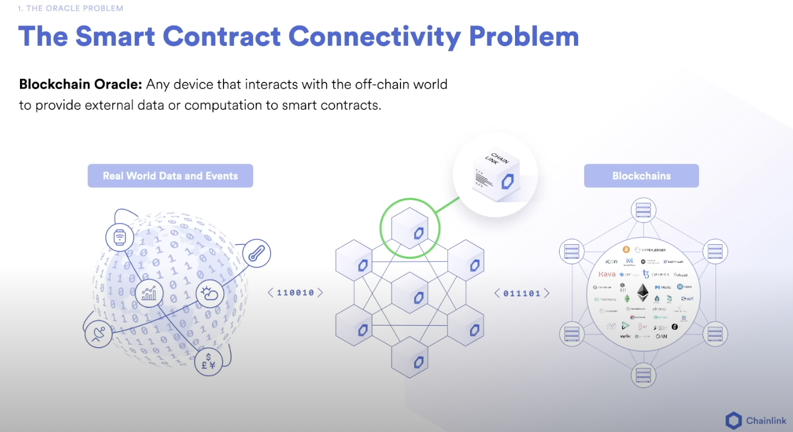
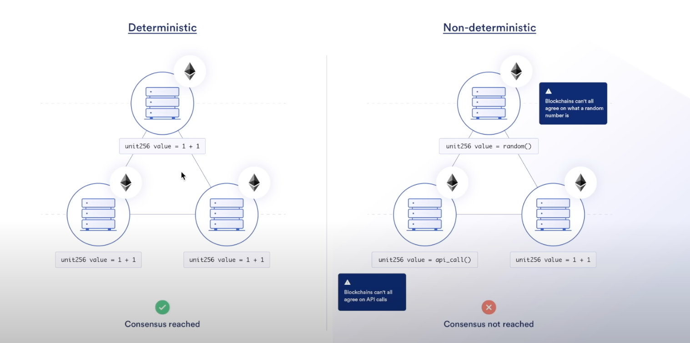
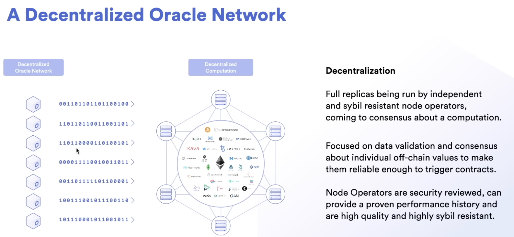

# Notes

## Terminology

- Dapp = Smart contract = Decentralized App = Decentralised Protocol
- Decentralised: No centralise source that control the blockchains
- Transparency & Flexibility
- Speed and Efficiency => faster settlement
- Security & immutability => cannot be tampered, as long as one node on the entire system is running, data won't be lost
- Removal of counterparty risk => remove conflict of interest, they wont be able to break the contract
- Trust minimized agreements => Trustless agreements
- Block explorer: An application that allows to view transactions on the blockchain
- Gas is a unit of computational measure. The more computation a transaction uses the more "gas" one has to pay. Every transaction that happens on chain pays a "gas fee" to node operators to execute the transaction. This is a way to prevent spam and attacks on the network.
- Gas Price: How much it costs per unit of gas. Gas price changes based on demand on the blockchain
- Gas Limit: Max amount of gas in a transaction
- Transaction Fee = Gas used \* Gas price

## Bitcoin

- One of the first protocol that leverage on blockchain technology
- Digital Store of Value, like a digital gold
- Bitcoin has a scarce quantity
- [Bitcoin Whitepaper](https://bitcoin.org/bitcoin.pdf)

## Ethereum

- Allows for smart contracts
- Smart contracts are self executing sets of instructions without 3rd parties
- Smart contracts allow for agreement without centralized intermediaries
- Wei is the smallest unit in Ethereum
- [Ethereum Whitepaper](https://ethereum.org/en/whitepaper/)

### The Oracle Problem

- Blockchain cannot access external data through API, it might cause the blockchain to be non-deterministic, fetching the data can be different at different times

- Blockchain are determinstic systems
- Blockchain Oracles: Bring external data or does computation
  - Example: Chainlink
  - [Data Chainlink](https://data.chain.link/)

## Blockcahin

- Hash: A unique fixed length string, meant to identify a piece of data
- The last hash in a block will encmpass all the data in the previous blocks as well
- Minig: The process of adding a block to the blockchain. The process of finding the "solution" to the blockchain "problem"
- Block: A list of transactions mined together
- Nonce: A number that can only be used once to get the hash
- Consensus: The mechanism used to agree on the state of the blockchain
  - Chain selection algorithm: Longest chain wins
  - Sybil resistance algorithm: Proof of work (minning) or Proof of stake
- Block confirmation: The number of blocks that have been mined on top of a particular block
- Gas prices can get really high due to high demand. Sharding is a solution to this problem. The main chain will coordinate the shards. Shards are like mini blockchains that are connected to the main chain.
- Layer 1: Base layer of blockchain implementation
- Layer2: Built on top of layer 1

## Solidity

- Memory: Temporary storage during execution
- EVN: Ethereum Virtual Machine. Code gets compiled down to EVM bytecode

### Programming

- Always define the solidity version
- Contract is like a class
- Note, mapping: mapping(string => unit256) public nameToFavoriteNumber
- view, external, internal, public, private
- memory and storage: memory is temporary, storage is permanent
- Interfaces compile down to an ABI, where ABI is Application Binary Interface. The ABI tells solidity and other programming languages how it can interact with another contract
- Anytime you want to interact with an already deployed smart contract you will need an ABI
- Anything less than solidity 0.8.0 will have to import SafeMathChainlink to check for overflows

# Tools

- [Eth Converter](https://eth-converter.com/)
- [Blockchain Demo](https://andersbrownworth.com/blockchain/)
